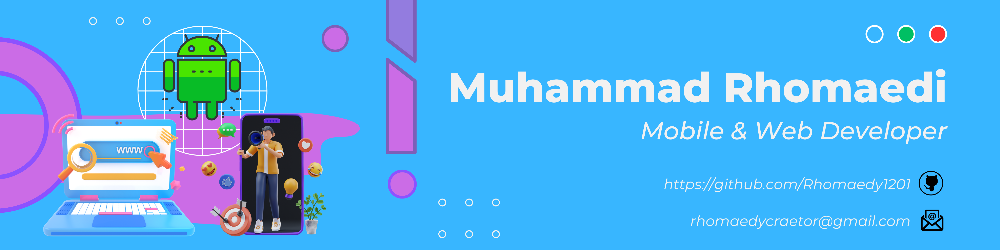

## Hi 👋, I'm Muhammad Rhomaedi

  

### 💫 About Me

I am a **Software Engineer & Full Stack Developer** with over 4 years of professional experience, specializing in cross-platform mobile development and robust backend architectures. 

- 💼 **Current Focus:** Building scalable mobile apps with **Flutter** & engineering high-performance APIs using **Laravel, Golang, and Python**.
- 🧠 **AI & Data Experience:** - Developed a student attendance system using Face Recognition (implementing 2D-LDA and KNN machine learning methods) built with Flutter and Laravel.
  - Built sentiment analysis models using IndoBERT (99.76% accuracy) and stock prediction engines using LSTM.
  - Engineered custom data retrieval logic directly from complex databases like MongoDB.
- 🚀 All of my projects and detailed portfolio are available at [muhammad-rhomaedi.vercel.app](https://muhammad-rhomaedi.vercel.app/)
- 💬 Ask me about: **Flutter state management, Backend Architecture (PHP/Go), Database Optimization, or API Integrations**.
- 📫 How to reach me: **rhomaedycreator@gmail.com**
- ⚡ Fun fact: I spend my free time analyzing blue-chip stocks or tuning my PC for 120fps native gameplay! 😄

### 🪩 Connect with me

### 🛠️ Tools & Frameworks

  
  
  
  
  
  
  
  
  
  
  
  
  
  

### 👨🏻‍💻 Languages

  
  
  
  
  
  
  
  
  

### 📈 Github Stats

